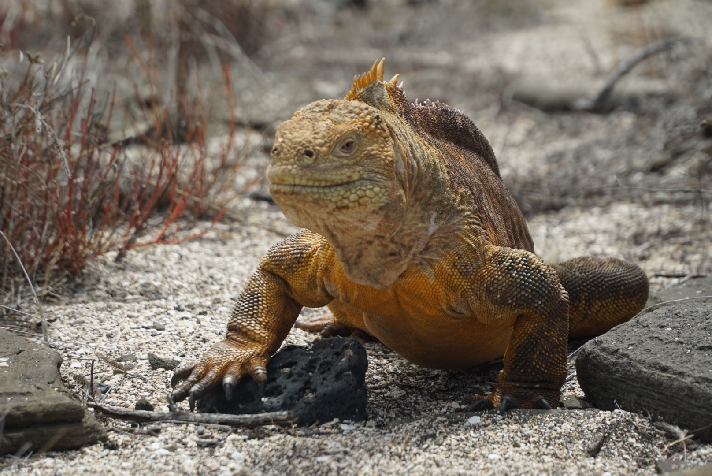

# Introduction to statistical bioinformatics

## Galapagos Islands
Since I'm a huge fan of the Galapagos islands, I'm going to show one of my favorite animal pictures I took there.

[Here](https://en.wikipedia.org/wiki/Gal%C3%A1pagos_Islands) you can find more information about these islands.